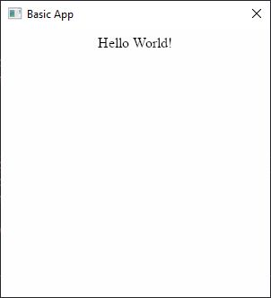

# HBUltralight
Harbour binding for Ultralight UI https://ultralig.ht/

## Quick start
From this piece of code:
```
#include <hbclass.ch>
#include "ultralight.ch"

proc main()
    LOCAL app := ultralight_app():Create()
    LOCAL window := ultralight_window():Create(app:main_Monitor,300,300,.F.,ulWindowFlags_Titled)
    LOCAL overlay
    window:SetTitle("Basic App")
    app:window := window
    overlay:=ultralight_overlay():Create(window,window:width(),window:height(),0,0)
    overlay:view():LoadHTML("<center>Hello World!</center>")
    app:Run()
```
You will obtain this:



To do this, download the latest release from [GitHub](https://github.com/APerricone/HBUltralight/releases).
And build your source with HBMK2 including hbultralight.hbc to your project file.

##  <u>**ONLY 64BIT APPLICATION ARE SUPPORTED**</u>

## How to compile from source
Download [ultralight](https://github.com/ultralight-ux/Ultralight/releases), and put the downloaded files on ultralight subfolder.
Then use HBMK2 to compile hbUltralightLib.hbc.

On Windows you can use the build.bat batch to setup the enviroment and build, It is pre-setted for use VS2017 and harbour from c:\harbour.

